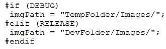
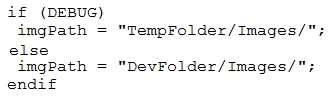
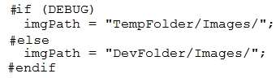
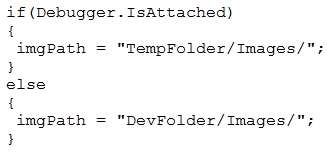

MIGUEL ÁNGEL CABRERO

09/11/2020

_________________________________________________________

QUESTION 056

You are developing an application that will process orders. The debug and release versions of the application will display different logo images.

You need to ensure that the correct image path is set based on the build configuration.

Which code segment should you use?

A. 

B. 

C. 

D. 

<u>Correct Answer</u>: **C**

Explanation:

There is no such constraint (unless you define one explicitly) RELEASE. 

References: http://stackoverflow.com/questions/507704/will-if-release-work-like-if-debug-does-in-c