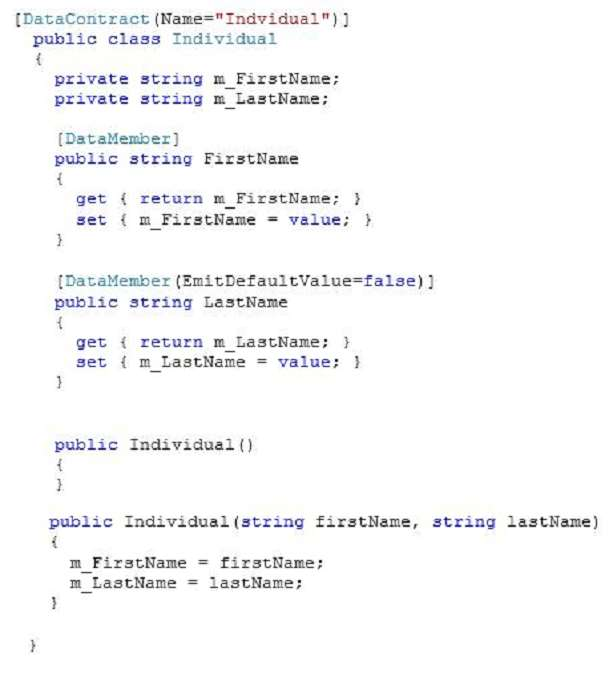
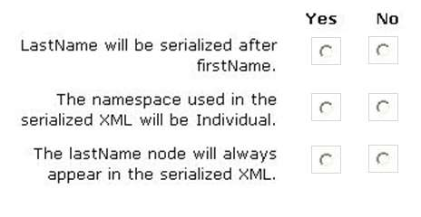
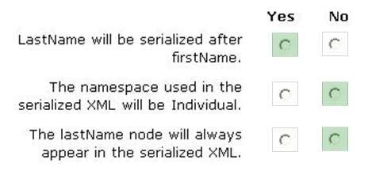

MIGUEL ÁNGEL CABRERO

09/11/2020

_________________________________________________________

QUESTION 081

HOTSPOT
You have the following code:

For each of the following statements, select Yes if the statement is true. Otherwise, select No.
NOTE: Each correct selection is worth one point
Hot Area:

**Correct Answer:** 

Explanation:
Note:

* The System.Runtime.Serialization namespace contains classes that can be used for serializing and deserializing objects. Serialization is the process of converting an object or a graph of objects into a linear sequence of bytes for either storage or transmission to another location. Deserialization is the process of taking in stored information and recreating objects from it.
* EmitDefaultValue DataMemberAttribute.EmitDefaultValue Property Gets or sets a value that specifies whether to serialize the default value for a field or property being serialized.
true if the default value for a member should be generated in the serialization stream; otherwise, false.