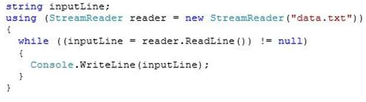

MIGUEL ÁNGEL CABRERO

09/11/2020

_________________________________________________________

QUESTION 112

You are developing an application that will read data from a text file and display the file contents.

You need to read data from the file, display it, and correctly release the file resources.

Which code segment should you use?

A. 

B. 

C. 

D. 

<u>Correct Answer</u>: **A**

Referencia:

https://docs.microsoft.com/es-es/dotnet/api/system.io.streamreader?view=net-5.0

Las opciones C y D también sacan el contenido del fichero por pantalla, sin embargo en C no cierra el objeto reader y en D si hay un error en la lectura, el código saldría del Try y no cerraría el fichero.