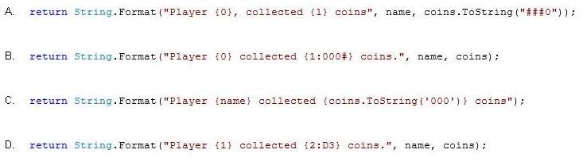

MIGUEL ÁNGEL CABRERO

09/11/2020

_________________________________________________________

QUESTION 126

You are developing a game that allows players to collect from 0 through 1000 coins. You are creating a method that will be used in the game. The method includes the following code. (Line numbers are included for reference only.)

01 public string FormatCoins(string name, int coins)

02 {

03

04 }

The method must meet the following requirements:

- Return a string that includes the player name and the number of coins.
- Display the number of coins without leading zeros if the number is 1 or greater.
- Display the number of coins as a single 0 if the number is 0.

You need to ensure that the method meets the requirements.

Which code segment should you insert at line 03?

<u>Correct Answer</u>: **A**

En el pdf se indica que la solución correcta es la D, pero su formato es erróneo. La C y la D dan error de ejecución por formato erróneo y la B siempre presenta 0 a la izquierda salvo que el valor sea 1000.
