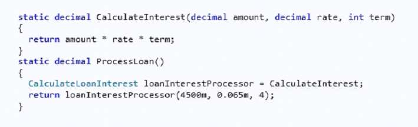
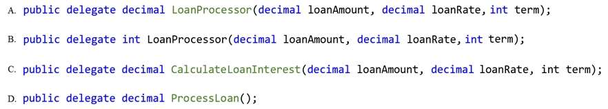

MIGUEL ÁNGEL CABRERO

09/11/2020

_________________________________________________________

QUESTION 143

You are developing an application for a bank. The application includes a method named ProcessLoan that
processes loan applications. The ProcessLoan() method uses a method named CalculateInterest. The
application includes the following code:

You need to declare a delegate to support the ProcessLoan() method.

Which code segment should you use?

<u>Correct Answer</u>: **C**

